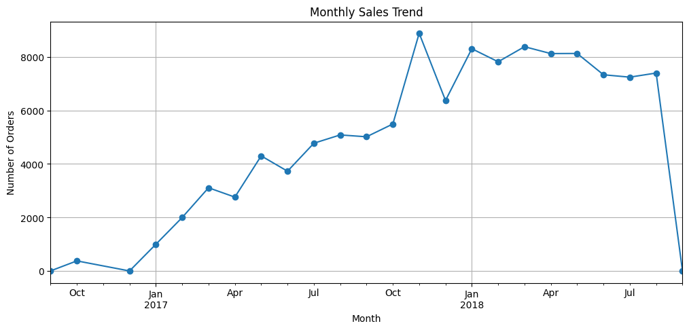
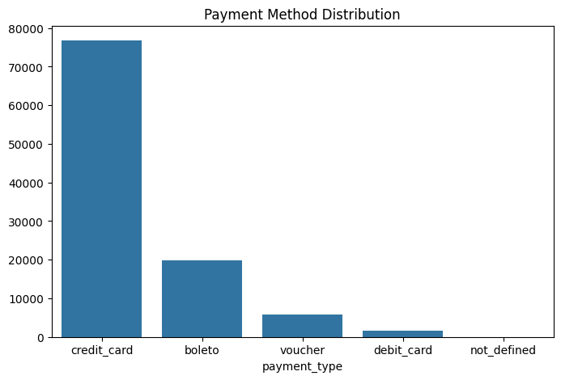

# 🛒 Brazilian E-Commerce Analysis (Olist)
>São Paulo alone holds 42% of all customers — yet the #1 seller processed 2,050+ orders while the #10 seller handled only ~1,150. The gap between top and average sellers is wider than the gap between SP and every other state combined

This project analyzes the Brazilian E-Commerce Public Dataset by Olist to uncover customer purchasing behavior, sales performance, payment preferences, delivery efficiency, and customer satisfaction and and translate them into concrete, data-backed business recommendations

## Dashboard Preview

### Monthly Sales Trend

### Payment Method

## 📌 Business Problems
Rather than describing the data, this analysis is designed to answer questions with real strategic implications:
1. Is the sales growth between 2017–2018 sustainable, or driven by a one-time spike?
2. Which product categories are high-volume but low-satisfaction — a risk to brand reputation?
3. Does paying in installments correlate with lower review scores or higher order values?
4. How much does each extra day of delivery delay cost in terms of customer satisfaction?
5. Which states are underserved relative to their population — representing growth opportunities?
6. Is seller performance concentrated? What separates top sellers from the rest?
7. What is the actual gap between estimated and real delivery time, and where is it worst?

## 📊 Key Findings
📈 Sales Trend
- Orders grew from near-zero in late 2016 to a peak of ~8,800 orders in November 2017 — a clear Black Friday spike.
- After the spike, monthly orders stabilized between 7,500–8,400 throughout 2018, suggesting the underlying growth is real and sustained — not purely seasonal.
- The sharp drop at the end of the chart (Sept 2018) is likely due to incomplete data in the dataset, not an actual collapse in sales.

## 🛍️ Product Categories
- Bed Bath Table leads with ~11,800 orders, followed closely by Health Beauty (~9,900) and Sports Leisure (~8,900).
- The top 3 categories alone account for a significant portion of all orders, indicating high concentration of demand.
- Categories like Telephony, Garden Tools, and Auto show relatively flat performance (~4,500 orders each) — potential growth segments if marketed strategically.

## 💳 Payment Preferences
- Credit card dominates with ~77,000 transactions — roughly 74% of all payments.
- Boleto (Brazilian bank slip) is the distant second at ~20,000, showing that a meaningful segment of customers still prefers non-card payment.
- Debit card and voucher usage is minimal, suggesting limited appetite for those channels.

## ⭐ Customer Satisfaction
- ~57,500 reviews are 5-star — the overwhelming majority, indicating a generally satisfied customer base.
- However, ~11,500 reviews are 1-star — a significant tail of dissatisfied customers that cannot be ignored.
- Reviews are bimodal: customers either love it (5 stars) or hate it (1 star), with very few landing in between. This signals that experience quality is inconsistent, not just average.

## 🚚 Delivery Performance
- The delivery time distribution is right-skewed: most orders arrive within 7–15 days, but there is a long tail of extreme outliers reaching 200+ days.
- The boxplot of Delivery Delay vs Review Score shows a clear pattern: 1-star reviews have a noticeably higher median delay and a much wider spread of positive delays compared to 5-star reviews.
- Even 4- and 5-star customers experience some delays, but their distributions are tighter and centered closer to zero — meaning on-time delivery strongly predicts satisfaction.

## 🗺️ Geographic Distribution
- São Paulo (SP) has ~42,000 customers — 3× more than Rio de Janeiro (RJ) at ~13,000, the next largest state.
- Minas Gerais (MG) ranks third with ~11,500 customers, followed by RS and PR in the 5,000–5,500 range.
- The remaining states (SC, BA, DF, ES, GO) each have under 3,500 customers — representing underserved markets with growth potential.

## 🏆 Seller Performance
- The #1 seller processed over 2,050 orders — nearly 80% more than the #10 seller (~1,150 orders).
- Performance drops sharply after the top 3 sellers, with the gap between rank 3 and rank 4 being notably steep.
- Seller IDs are anonymized, making it impossible to attribute performance to geography or category — a limitation worth noting.

## 💡 Business Recommendations
- Target the 1-star tail, not the average.With ~57,500 five-star reviews, satisfaction is generally high — but the 11,500 one-star reviews represent a concentrated problem. The delivery delay boxplot shows 1-star orders have significantly more positive delay outliers (late deliveries). Investigate which seller-region combinations produce the most delayed orders and apply stricter SLAs there first.
- Expand seller recruitment in RJ, MG, and underserved states.Rio de Janeiro (~13,000 customers) and Minas Gerais (~11,500) together represent nearly 25% of SP's customer base, but with far fewer local sellers. Reducing logistics distance in these states would directly cut delivery times and likely convert borderline 3–4 star experiences into 5-star ones.
- Build a Boleto retention strategy.~20,000 transactions via Boleto suggest a non-trivial segment that doesn't use credit cards. This group is at higher risk of cart abandonment (Boleto requires manual payment). Consider streamlining the Boleto flow or offering micro-incentives for on-time payment to reduce order drop-off.
- Use November as a stress test, not just a revenue opportunity. The Nov 2017 spike to ~8,800 orders revealed whether logistics could scale. Use that month's data to identify which categories and sellers failed to maintain satisfaction during peak load — and fix those bottlenecks before the next peak season.
- Develop a seller tier program. The top seller processed 78% more orders than the #10 seller. This concentration is a risk — if top sellers churn, revenue drops sharply. A tiered incentive program (better placement, lower fees) for sellers ranked 5–20 could reduce dependency on the top 3 while growing the overall high-performer base.

## 🗂️Dataset

Source: Kaggle (https://www.kaggle.com/datasets/olistbr/brazilian-ecommerce)

|Dataset| Description|
| :--- | :--- | 
|olist_customers_dataset.csv| Customer ID, location|
|olist_orders_dataset.csv|Order status, timestamps|
|olist_order_items_dataset.csv|Items per order, price, freight|
|olist_products_dataset.csv|Product dimensions, category|
|olist_sellers_dataset.csv| Seller ID, location|
|olist_order_payments_dataset.csv|Payment type, installments, value|
|olist_order_reviews_dataset.csv|Review score, comment, timestamp|
|olist_geolocation_dataset.csv|ZIP code coordinates|
|product_category_name_translation.csv|Category name (PT → EN)|

## Tools 
|Tools|Purpose|
| :--- | :--- | 
|Python 3.10|Core language|
|Pandas| Data manipulation & merging|
|Matplotlib / Seaborn|Static visualizations|
|Google Colab|Development environment|

## ⚙️ How to Run
1. Clone this repository
git clone https://github.com/jihanlatifah/Brazilian-Ecommerce-Analysis.git
2. Download the dataset from Kaggle and place CSVs in the data/ folder
3. Open notebooks/brazilian_ecommerce_analysis.ipynb in Google Colab or Jupyter
4. Run all cells sequentially

